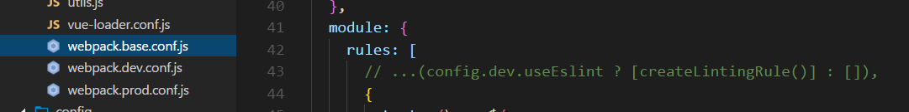

# vue 后台管理系统

> 撸后台管理系统笔记

## 项目解读

### 干掉esLint

- 学新东西就要先摘掉一些不必要的干扰项




### 关于国际化语言


- 所有关于国际化的配置都在如上几个文件中
- 侧边栏的所有item都是通过方法生成出来的


```js
// 翻译标题的方法
export function generateTitle(title) {
  return this.$t('route.' + title) // $t :是 vue-i18n自带的方法,用来注入这个路径下的 		@/lang/index.js  翻译语言
}
```

- 所以先一个新组件的时候步骤如下:
  1. 在`@/route/index.js` 将新组建的路由配置好
  2. 在`@/lang/zh.js` 配置路由的名字
  3. 创建一个新的组件就可以了

